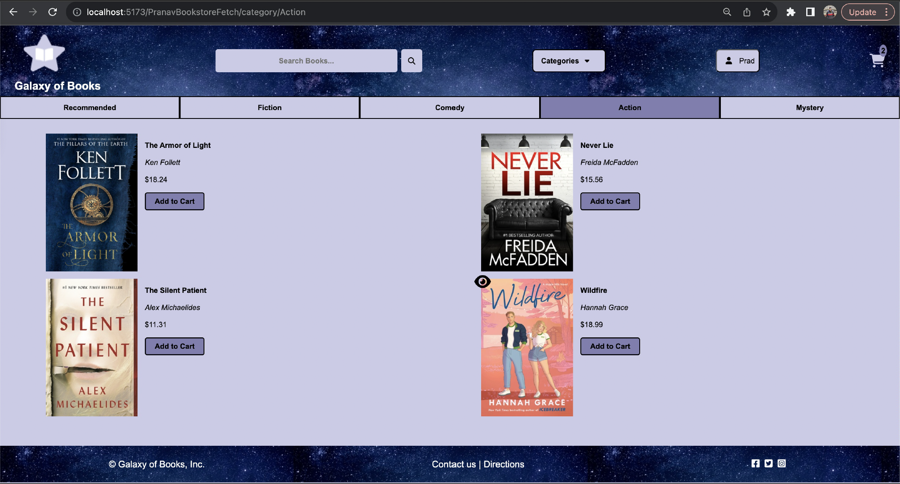
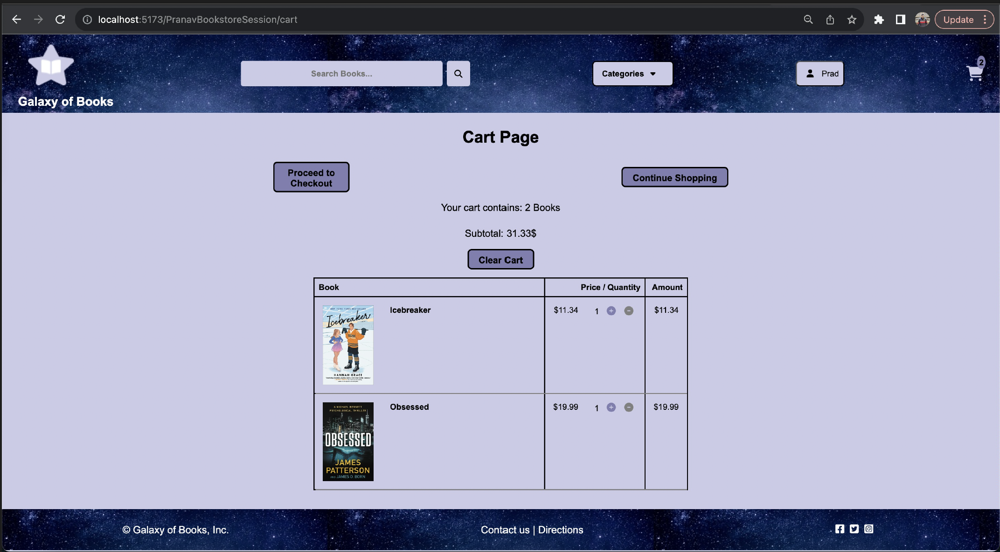
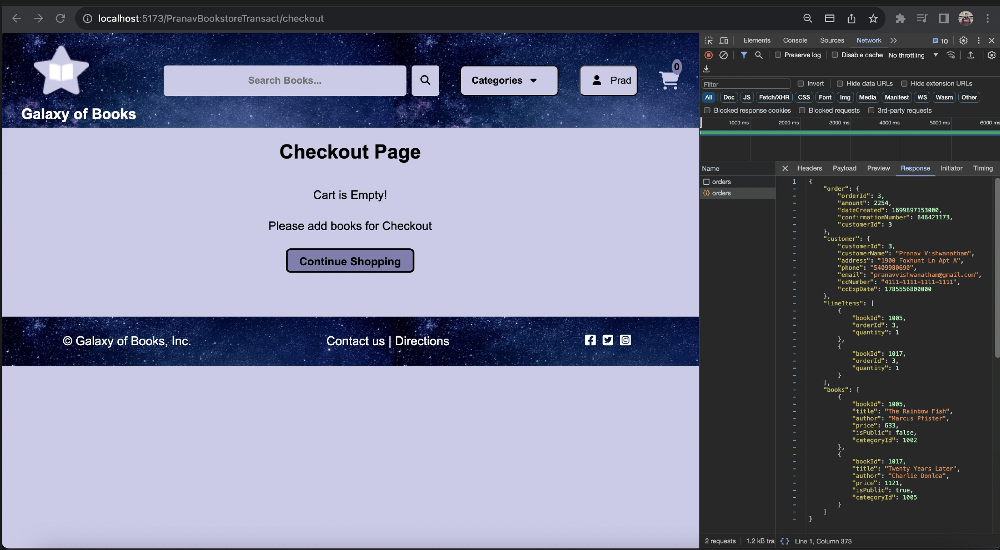

# Galaxy of Books 📚

A full-stack web application simulating a bookstore, developed as part of the **CS-5244 Web Application Development** course at **Virginia Tech (Fall 2023)**.

This project demonstrates key concepts in server-side Java web development, including servlets, JSP, RESTful APIs, session handling, and dynamic content rendering.

---

## 🛠 Features

- 🔐 Login and session management
- 📚 Book listings with images and categories
- 🔍 Book detail views
- 🧠 Browsing history and state management
- 🌐 RESTful API integration
- 🧩 MVC-like separation of logic and presentation

---

## ▶️ How to Run

1. Open the project in **IntelliJ IDEA Ultimate**
2. Configure a local **Tomcat Server** in IntelliJ
3. Build and deploy the app as an exploded WAR
4. Access it at: `http://localhost:8080/PranavBookstoreTransact/`

---

## 🧰 Technologies Used

- Java (Servlets, JSP)
- HTML, CSS, JavaScript
- REST APIs
- Gradle
- Apache Tomcat (for deployment)

## 🌌 Project Screenshot

Here’s what the homepage of *Galaxy of Books* looks like:

